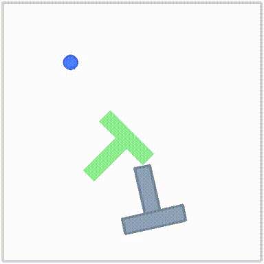
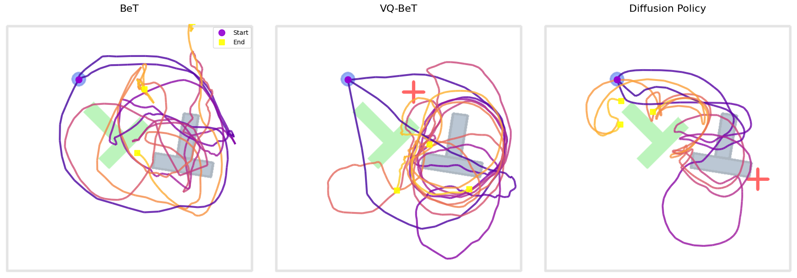
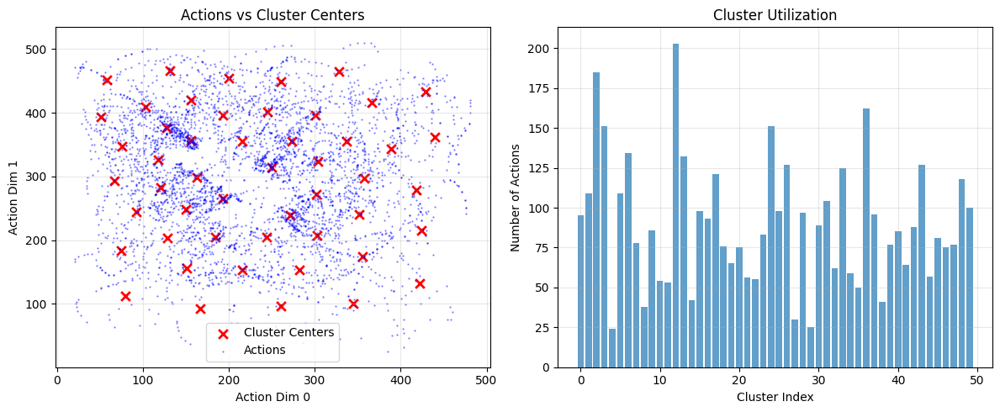
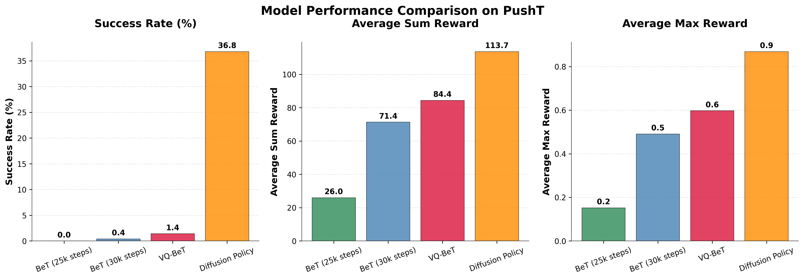

# Behavior Transformer (BeT) for PushT Robotic Manipulation

This repository implements the **Behavior Transformer (BeT)** method from the paper ["Behavior Transformers: Cloning k modes with one stone"](https://arxiv.org/pdf/2206.11251) for the PushT robotic manipulation task using the LeRobot framework as part of a coding challenge.

### Task Overview

**Task**: Push T-shaped object onto target area using robot end-effector
- **Dataset**: 206 episodes (~25k frames) with 96×96 RGB images + robot state
- **Action Space**: 2D continuous control (target position)
- **Success criterion**: ≥95% block-target overlap


## Results

### Qualitative Results: Agent Rollouts
Sample rollouts comparing BeT to baseline methods. All models were trained for 25,000 training steps if not specified differently and evaluated on the same episode

| BeT | BeT (30k) | VQ-BeT | Diffusion Policy |
|:---:|:---:|:---:|:---:|
|  |  |  |  |

All those models apart from BeT (30k) were trained using the the training script [`lerobot/scripts/train.py`](https://github.com/FlorianSp2000/lerobot/tree/bet-integration/src/lerobot/scripts/train). Interestingly, when training the BeT model using our [`train.ipynb`](train.ipynb) the performance becomes notably better. The largest (known) difference should come from the different learning rate (schedule). Our training code used Adam with constant lr=1e-4 and a offset_loss_multiplier of 1000 while the training script was run with different offset_loss_multiplier values and learning rate 3e-4 with warm up phase and cosine schedule and weight decay.

In the following the results all refer to BeT (30k).



The kMeans clustering of our model in the PushT action space and its utilization when running a couple of batches through it:



---

### Quantitative Results
The evaluation of each policy for 500 episodes in the PushT gym env:



---

## Setup & Usage

### 1. Installation
The code was tested on Ubuntu 22.04 with Python 3.10.

First clone repository with submodules

```
git clone --recursive https://github.com/FlorianSp2000/behavior-transformer-for-robotic-manipulation
```

```
# Create a virtual environment with Python 3.10 and activate it
cd lerobot
conda create -y -n lerobot python=3.10
conda activate lerobot
```

```
# Install lerobot and dependencies for PushT
pip install -e .
pip install -e ".[pusht]"
pip install -e ./lerobot
```

```
# (Optional) To use W&B:
wandb login
```

### Implementation Details
Our BeT policy is implemented in lerobot/policies/bet/ following the LeRobot framework's conventions.

- Architecture: The model uses a ResNet-18 vision backbone and a minGPT transformer with causal self-attention, matching the approach in the VQ-BeT baseline. The method uses state tokens (joint positions are passed through its own MLP) and a special learnable vector called action_token is created. The transformer has one MLP prediction head for action bin classification and residual offset prediction.

- Action Discretization: We use k-means clustering to discretize the continuous action space. The k-means fitting process runs automatically for the first kmeans_fit_steps of training, collecting actions from the dataset to build the clusters.

- Normalization & Loss: The implementation uses min-max normalization for observations and actions. The total loss is a weighted sum of Focal Loss for the classification task and MSE Loss for the offset regression, as described in the [original paper](https://arxiv.org/pdf/2206.11251).


### Design choices and Challenges 
**Loss Balancing**
- *Problem*: Classification loss dominated, leading to poor continuous control
- *Solution*: Increased offset loss weight from 0.1 gradually to 10000, finding best results with 1000-10000

**Cluster Persistence** 
- *Problem*: K-means clusters not saved with model checkpoints, causing silent reinitialization
- *Solution*: Used `register_buffer()` to properly save cluster centers and fitting status

**Systematic Bias**
- *Problem*: Too few clusters led to asymmetric action distribution and negative offset bias
- *Solution*: Balanced cluster count (~50) 

Furthermore, I chose to stick to ResNet-18 backbone and minGPT transformer so comparison against VQ-BeT highlights most important architectural difference, which is in action discretization method. I kept action chunking and set action chunking size to 1 for compatibility. Also took over the default delta observation steps, i.e. our model would receive n_obs_steps=5 observations per time step and n_action_pred_token=3 for number of action tokens. 

### Future Improvements
1. **Systematic Hyperparameter Tuning**: Grid search over offset weights, cluster counts, and LR schedules
2. **Advanced Clustering**: Replace naive k-means with k-means++ initialization or learned clustering
3. **Architecture Scaling**: Larger transformers with more layers and longer context windows
4. **Goal Conditioning**: Add target-aware conditioning for better task performance
5. **Longer Training Duration**: Models did not converge within 30k steps (the checkpoints available on HuggingFace for VG-BeT and Diffusion Policy were run for more than ~200k steps)
 
## 🐳 Cluster Usage

For Slurm clusters:
```bash
# Build container
singularity build --fakeroot lerobot.sif lerobot.def

# Run Jupyter with GPU
singularity exec --nv --bind external/bet:/bet lerobot.sif jupyter notebook \
  --ip=0.0.0.0 --port=8888 --no-browser --notebook-dir=/bet
```

## 📈 Reproducing Results
Shell scripts are provided to run training and evaluation. Edit the scripts to change default parameters like output paths if desired. The final model configurations (config.json) are included in the repository.

1. Run baseline training: `sbatch train_baselines.sbatch`
2. Train BeT model: `sbatch bet_train.sbatch` 
3. Evaluate models: `sbatch bet_eval.sbatch`

Results saved to `outputs/train/` and `outputs/eval/` by default. Modify output paths in scripts as needed.

The creation of most plots can be seen in exploration.ipynb.

The model comparison plot was created running:

```
python plot_results.py --base_path=outputs/eval
```

---

*Implementation completed as part of AI Imitation Learning coding challenge*